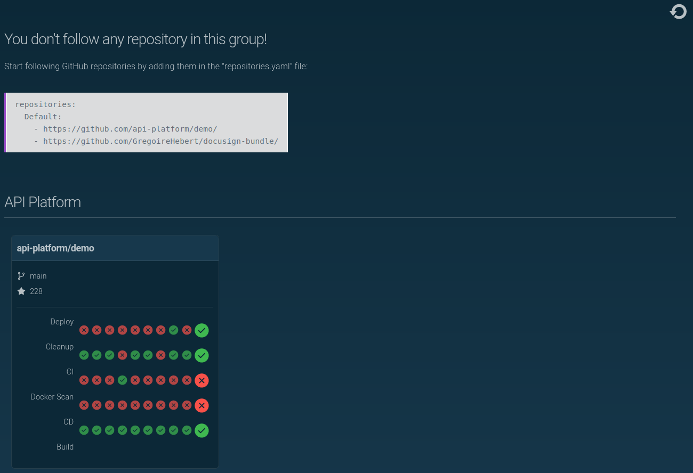

# GitHub Dashboard


This project provides a dashboard to follow GitHub repositories workflows.



# Requirements

- [PHP](https://www.php.net/) >= 8.0
- [Symfony](https://symfony.com/download)
- [GitHub Personal Access Token](https://github.com/settings/tokens/new?scopes=repo&description=GitHub+Dashboard)

# Install

```shell
git clone git@github.com:vincentchalamon/dashboard.git dashboard
cd dashboard
symfony server:start
```

# Configuration

Generate a [GitHub Personal Access Token](https://github.com/settings/tokens/new?scopes=repo&description=GitHub+Dashboard)
and change the GITHUB_API_TOKEN environment variable with your own.

_Note: it's recommended to dump the environment variables using composer:_

```shell
composer dump-env prod
```

Create the `repositories.yaml` file at the root of your project, as following:

```yaml
repositories:
  - https://github.com/api-platform/demo/
  - https://github.com/GregoireHebert/docusign-bundle/
```

_Note: to prevent too many requests to the GitHub API, data are stored in cache. To refresh them, just clear the pool:_

```shell
bin/console cache:pool:clear cache.repository
```
