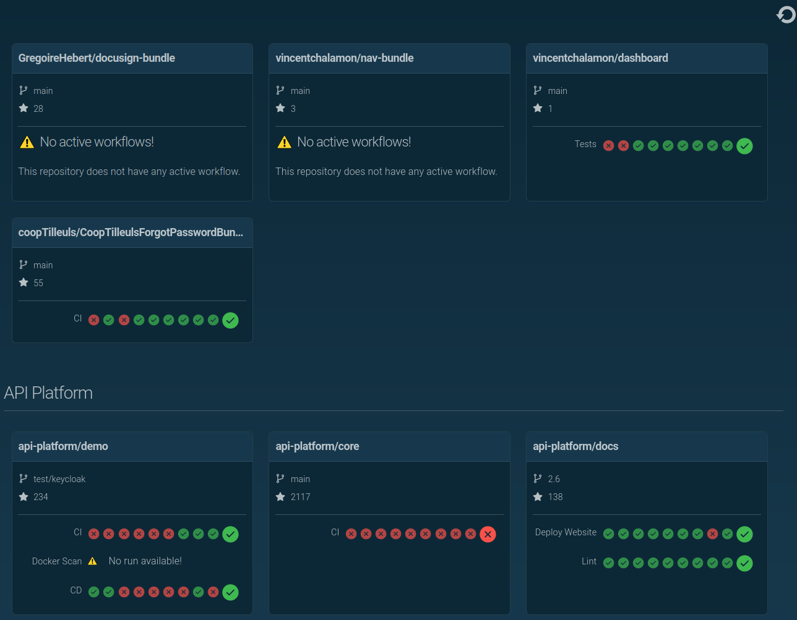

# Dashboard


This project provides a dashboard to follow your GitHub repositories workflows.



## Install

### Requirements

- [PHP](https://www.php.net/) >= 8.1
- [GitHub Personal Access Token](https://github.com/settings/tokens/new?scopes=repo&description=GitHub+Dashboard)
- [Symfony](https://symfony.com/download) (for local usage)

### Install Locally

```shell
git clone git@github.com:vincentchalamon/dashboard.git dashboard
cd dashboard
symfony composer install
symfony composer dump-env prod
symfony server:start
```

### Configuration

Configure a
[GitHub Personal Access Token](https://github.com/settings/tokens/new?scopes=repo&description=GitHub+Dashboard) on the
`GITHUB_API_TOKEN` environment variable.

Create the `repositories.yaml` file at the root of your project, as following:

```yaml
repositories:
    Default:
        # Repository url without options
        - https://github.com/GregoireHebert/docusign-bundle/

    # Grouped repositories
    API Platform:
        # Repository name (default server: https://github.com)
        api-platform/demo:
            # Follow this branch instead of the default one
            branch: develop
            # Follow these workflows only
            workflows:
                - foo
                - bar
```

## Usage

### Cache

The repositories configuration is stored in the `cache.repository` cache pool. To clear it, fun the following command:

```shell
bin/console cache:pool:clear cache.repository
```

You can then warm it up:

```shell
bin/console cache:warmup
```

#### Add your own cache

To prevent to reach the `X-Rate-Limit` on GitHub API, a cache has been set on the GitHub client, with 1 week TTL.
To add your own cache on your own client, configure the cache on Symfony and add a CacheClearer class:

```yaml
# config/packages/cache.yaml
framework:
    cache:
        # ...
        pools:
            # ...
            cache.foo:
                adapter: cache.adapter.filesystem
                default_lifetime: '1 week'
```

```php
// src/Cache/FooCacheClearer.php
declare(strict_types=1);

namespace App\Cache;

use Symfony\Component\DependencyInjection\Attribute\Autowire;
use Symfony\Component\HttpKernel\CacheClearer\CacheClearerInterface;
use Symfony\Component\HttpKernel\CacheClearer\Psr6CacheClearer;

final class FooCacheClearer implements CacheClearerInterface
{
    public function __construct(
        #[Autowire('@cache.global_clearer')] private readonly Psr6CacheClearer $poolClearer
    ) {
    }

    /**
     * {@inheritdoc}
     */
    public function clear(string $cacheDir): void
    {
        $this->poolClearer->clearPool('cache.foo');
    }
}
```

### Connect to a Remote Server

By default, only GitHub is supported. But you can easily connect to a remote server (e.g.: [GitLab](https://gitlab.com/)):

```php
// src/Server/FooServer.php
declare(strict_types=1);

namespace App\Server;

use App\Metadata\RepositoryMetadataInterface;
use App\Model\Workflow;
use Psr\Log\LoggerInterface;
use Symfony\Contracts\HttpClient\HttpClientInterface;

final class FooServer implements ServerInterface
{
    public function __construct(private readonly HttpClientInterface $client, private readonly LoggerInterface $logger)
    {
    }

    public function getDefaultBranch(RepositoryMetadataInterface $repository): string
    {
        // Call remote server API and return the repository default branch
    }

    public function getWorkflows(RepositoryMetadataInterface $repository): iterable
    {
        // Call remote server API and yield a Workflow object for each repository workflow
    }

    public function getStars(RepositoryMetadataInterface $repository): int
    {
        // Call remote server API and return the repository stars number
    }
}
```

> Note: to prevent to reach any `X-Rate-Limit`, you should consider [adding your own cache](#add-your-own-cache).

## Credits

Created by [Vincent CHALAMON](https://github.com/vincentchalamon).
