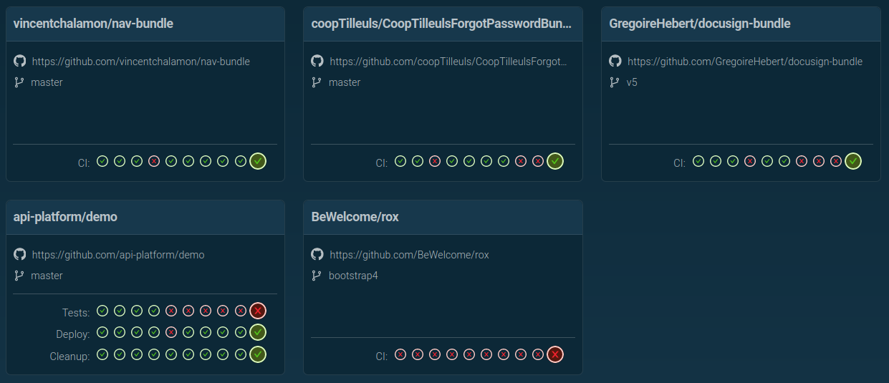

# GitHub Dashboard

This project provides a dashboard to follow GitHub repositories workflows.



# Requirements

- [PHP](https://www.php.net/) >= 7.4
- [Symfony](https://symfony.com/download)
- [Redis](https://redis.io/)

# Install

```shell
git clone <url> dashboard
cd dashboard
symfony server:start
```

# Configuration

Create the `repositories.yaml` file at the root of your project, as following:

```yaml
repositories:
  - https://github.com/api-platform/demo/
  - https://github.com/GregoireHebert/docusign-bundle/
```
